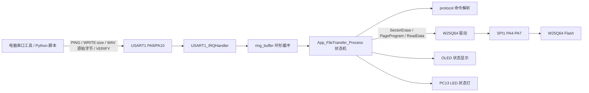

# MP3-Learn-01-Downloader 学习说明

## 1. 本项目目标

本项目只学习一件事：电脑通过 USART1 把一个 WAV 文件发送给 STM32，STM32 再通过 SPI1 写入 W25Q64 外部 Flash。

它从完整工程中保留了已经能工作的下载链路，删掉了 WAV 解析、音频播放、验证读回工程入口等暂时无关内容。学完本项目，你应该能看懂“串口收字节 -> 协议状态机 -> W25Q64 擦除/写入/CRC 校验”这一条链。

## 2. 数据流图



## 3. 主要文件说明

- `User/main.c`：本学习项目入口，只负责初始化外设、检查 W25Q64、循环执行下载状态机。
- `User/app_file_transfer.c/.h`：下载核心状态机。处理 `PING`、`WRITE:size`、`VERIFY`，并把文件数据按页写入 Flash。
- `User/protocol.c/.h`：把串口文本命令解析成枚举命令，并生成 `READY`、`OK`、`ERR` 等响应。
- `User/ring_buffer.c/.h`：USART 中断和主循环之间的缓冲区，避免中断里做复杂工作。
- `User/bsp_usart.c/.h`：USART1 初始化、中断接收、阻塞式字符串发送。
- `User/bsp_w25q64.c/.h`：W25Q64 的底层 SPI 命令，包含读 ID、扇区擦除、页编程、连续读取。
- `User/w25q64.c/.h`：面向应用层的 W25Q64 小包装，提供 JEDEC ID 检查和安全读接口。
- `Hardware/OLED.c/.h`：OLED 显示状态，使用 PB8/PB9 软件 I2C。
- `System/Delay.c/.h`：毫秒/微秒延时。
- `Library/`：STM32F10x 标准外设库，本项目 Keil 工程只引用 RCC、FLASH、GPIO、SPI、USART、NVIC 相关源文件。

## 4. 核心函数调用链

启动和初始化：

```text
main
  -> RCC_Configuration
  -> NVIC_Configuration
  -> USART1_Init
  -> GPIO_Configuration
  -> SPI1_Configuration
  -> W25Q64_DriverInit
  -> OLED_Init
  -> W25Q64_ReadJedecID
  -> App_FileTransfer_Init
```

串口收数据：

```text
USART1_IRQHandler
  -> USART_ReceiveData
  -> RingBuffer_Put
```

写入 Flash：

```text
main while(1)
  -> App_FileTransfer_Process
     -> App_HandleCommand
        -> Protocol_FeedByte
     -> W25Q64_SectorErase
     -> W25Q64_PageProgram
     -> W25Q64_ReadData
     -> Protocol_BuildResponse
     -> USART1_SendString
```

## 5. main.c 执行流程逐行讲解

- 第 1-10 行：文件头说明工程目标、系统时钟和本项目用到的引脚。
- 第 12-18 行：包含本项目需要的头文件。注意这里没有 `wav.h`、`audio_player.h`，因为下载阶段不解析、不播放。
- 第 20-28 行：`LED_Blink` 是启动提示函数，用 PC13 LED 闪烁表示硬件检查结果。
- 第 30-50 行：`RCC_Configuration` 把外部 8MHz 晶振配置到 72MHz 系统时钟。
- 第 52-72 行：`GPIO_Configuration` 初始化 PC13 LED 和 W25Q64 片选 PA4，并默认拉高 CS。
- 第 74-105 行：`SPI1_Configuration` 初始化 PA5/PA6/PA7 和 SPI1 主机模式，后面 W25Q64 读写都走这里。
- 第 107-110 行：`NVIC_Configuration` 设置中断优先级分组。
- 第 112-117 行：进入 `main`，定义循环计数、Flash ID、下载状态变量。
- 第 118-123 行：依次初始化时钟、中断、串口、GPIO、SPI、W25Q64 驱动。
- 第 125-128 行：初始化 OLED，串口输出启动日志。
- 第 130-139 行：读取 W25Q64 JEDEC ID。如果容量码兼容 W25Q64，OLED 显示 OK；否则显示 FAIL 并闪灯提示。
- 第 141-144 行：初始化文件传输状态机，OLED 显示等待 `WRITE` 命令。
- 第 146-152 行：主循环每次调用 `App_FileTransfer_Process`，并周期刷新 OLED。
- 第 154-171 行：根据状态机状态控制 LED：空闲熄灭，擦除/接收/校验时闪烁，等待发送文件数据时常亮。

## 6. 关键外设作用

- USART：电脑和 STM32 的通信通道。电脑发命令和 WAV 字节，STM32 回 `PONG`、`READY`、`OK:size`、`OK:CRC` 或 `ERR`。
- SPI：STM32 访问 W25Q64 的总线。PA5 是 SCK，PA6 是 MISO，PA7 是 MOSI，PA4 是软件控制的 CS。
- W25Q64：外部 8MB Flash。下载项目把 WAV 文件从地址 0 开始连续写入。
- DAC：本项目未使用。下载阶段只负责保存文件，不产生模拟音频。
- DMA：本项目未使用。USART 使用 RXNE 中断收字节，Flash 写入由主循环状态机执行。
- Timer：本项目没有专门使用定时器；只使用 `Delay` 做启动提示和 W25Q64 忙等待。

## 7. 应该重点看哪些代码

建议顺序：

1. 先看 `User/main.c`，理解初始化顺序和主循环。
2. 再看 `User/app_file_transfer.c` 的 `App_FileTransfer_Process`，这是下载项目的核心。
3. 然后看 `User/protocol.c`，理解为什么先发文本命令，再发原始 WAV 字节。
4. 最后看 `User/bsp_w25q64.c`，把扇区擦除、页编程、读数据和 W25Q64 手册对应起来。

## 8. 常见问题和调试方法

- 串口没有任何输出：检查波特率是否为 115200，PA9/PA10 是否接反，GND 是否共地。
- 一直收不到 `READY`：检查发送命令是否是 `WRITE:文件大小\n`，文件大小不能为 0，也不能超过 8MB。
- 写入中途返回 `ERR`：常见原因是 SPI 接线、W25Q64 供电、CS 引脚或擦除超时。
- `VERIFY` 的 CRC 和电脑不一致：确认发送的是 WAV 原始二进制文件，不是串口工具把内容当文本处理；也确认没有多发换行字节到文件数据里。
- OLED 卡在 `W25Q64:FAIL`：先看串口日志，再用示波器/逻辑分析仪检查 SPI1 是否有时钟和片选。
- 接收大文件不稳定：降低串口发送速度或增加电脑端分块发送间隔，因为本项目是串口中断 + 主循环写 Flash，没有 DMA。

## 9. 和完整 MP3 工程的对应关系

本项目来自完整工程的 `APP_MODE_TRANSFER` 分支。完整工程里 `main.c` 用宏切换下载、验证、播放三种模式；本学习项目把下载模式单独拿出来，入口更短，文件更少。

对应关系：

- 本项目 `User/app_file_transfer.c` 对应完整工程同名文件，是下载状态机主体。
- 本项目 `User/protocol.c`、`User/ring_buffer.c`、`User/bsp_usart.c` 对应完整工程的串口传输层。
- 本项目 `User/bsp_w25q64.c`、`User/w25q64.c` 对应完整工程的 Flash 访问层。
- 学懂后回到完整工程时，先找 `APP_MODE_TRANSFER`，再把它和 `APP_MODE_PLAYBACK` 对比，就能看出“先写入 Flash，再从 Flash 播放”的完整闭环。
