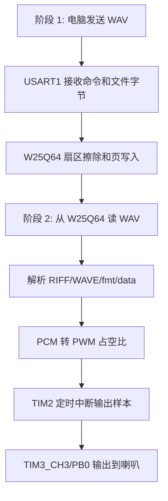

# MP3 分模块学习总览

## 两个小项目分别解决什么问题

`MP3-Learn-01-Downloader` 解决“文件怎么进 Flash”的问题。电脑通过 USART1 发送命令和 WAV 原始字节，STM32 用状态机接收数据，通过 SPI1 擦写 W25Q64，最后可以用 CRC 验证写入内容。

`MP3-Learn-02-Player` 解决“Flash 里的 WAV 怎么变成声音”的问题。STM32 从 W25Q64 读取 WAV，解析出采样率、位深、声道和 PCM 数据位置，再用 TIM2 定时、TIM3_CH3 PWM 输出到 PB0。

## 它们和完整播放器的关系

完整 `STM32_MP3_WAV播放器` 工程把下载、验证、播放放在同一个工程里，通过 `APP_MODE_TRANSFER`、`APP_MODE_VERIFY`、`APP_MODE_PLAYBACK` 宏选择运行模式。两个学习工程没有重写无关架构，而是从完整工程裁剪出两条已经能工作的主链路：

- 下载工程对应完整工程的 `APP_MODE_TRANSFER`。
- 播放工程对应完整工程的 `APP_MODE_PLAYBACK`。
- 两个工程共用完整工程里的 W25Q64、SPI、USART、OLED、Delay、标准库启动代码。
- 播放链路沿用当前完整工程的 PWM 方案：PB0/TIM3_CH3 输出音频，TIM2 负责采样率节拍；未改成 HAL，也未改成 DAC + DMA。

## 推荐学习顺序

1. 先打开 `MP3-Learn-01-Downloader/Project.uvprojx`，从 `User/main.c` 开始看。
2. 跟着 `App_FileTransfer_Process` 看状态变化：IDLE -> ERASING -> READY -> RECEIVING -> IDLE。
3. 用串口工具或现有脚本下载一个 WAV 到 W25Q64，确认 OLED 和串口响应正常。
4. 再打开 `MP3-Learn-02-Player/Project.uvprojx`，从 `User/main.c` 开始看。
5. 跟着 `WAV_ParseFromFlash` 看 WAV 头解析，再跟着 `AudioPlayer_Start` 看双缓冲填充。
6. 最后读 `TIM2_IRQHandler`，理解每一次采样中断如何更新 TIM3 PWM 占空比。

## 学完后如何回到完整工程继续理解

回到 `STM32_MP3_WAV播放器/User/main.c` 时，不要一上来从头到尾硬读。建议按下面顺序对照：

1. 找 `APP_MODE_TRANSFER` 分支，把它和 `MP3-Learn-01-Downloader/User/main.c` 对比。
2. 找 `APP_MODE_PLAYBACK` 分支，把它和 `MP3-Learn-02-Player/User/main.c` 对比。
3. 再看完整工程中额外保留的 `verify.c`，它用于从 Flash 读回数据做验证，是下载和播放之间的调试桥梁。
4. 最后再看 OLED、Key、历史归档和文档材料，这些是完整项目体验和调试辅助，不是主数据流。

## 你应该形成的整体图景

理解这张图后，再看完整 MP3/WAV 播放工程就会轻很多：完整工程不是一团代码，而是“下载到 Flash”和“从 Flash 播放”两条链路共用同一套底层驱动。
