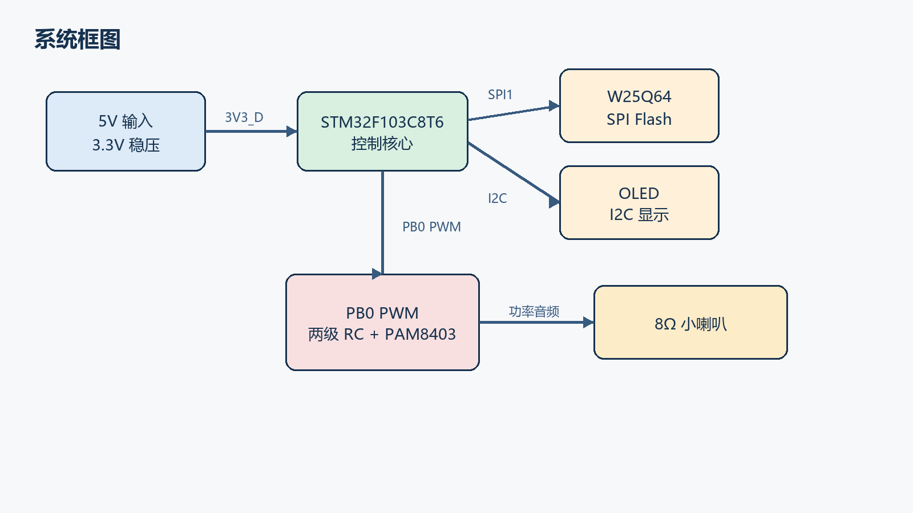
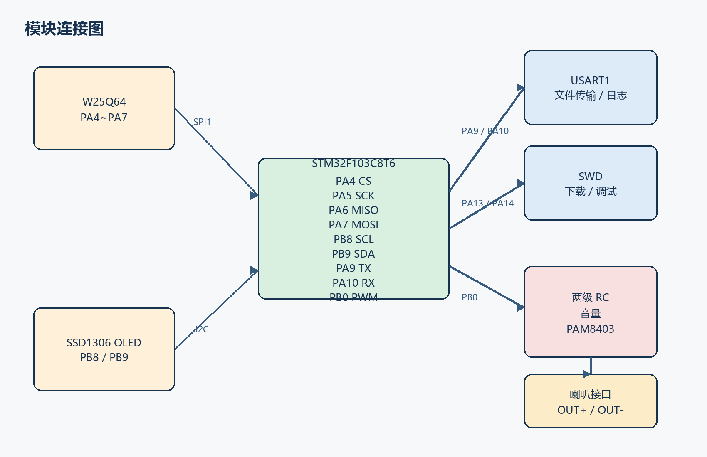
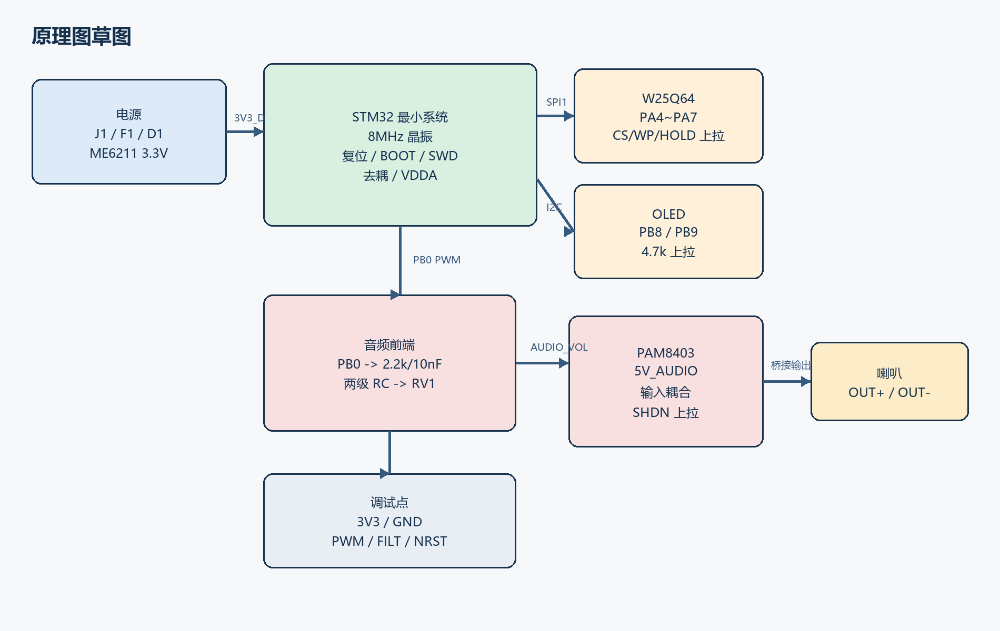
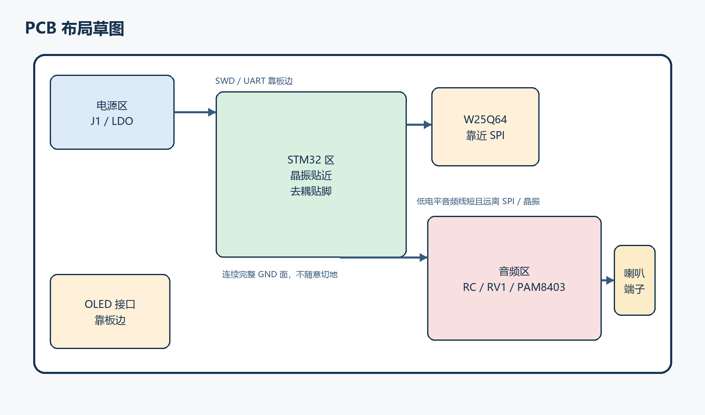

# STM32 MP3/WAV 播放器硬件设计学习手册

> 适用对象：第一次自己做单片机硬件板、但已经完成本项目软件验证的学习者。  
> 本手册的目标不是只给出“怎么接”，而是让你以后只看这一份文档，就能理解整块播放器硬件为什么这样设计。

# 第一章：项目简介

## 1.1 这次硬件设计和之前软件阶段有什么不同

之前的软件阶段，重点是证明这条数字链路已经跑通：

```text
电脑 -> 串口 -> STM32 -> W25Q64 -> WAV文件 -> PCM样本 -> 定时输出
```

它解决的是“文件能不能正确写进去、读出来、解析出来、按节拍播放出来”。  
但那时并没有把一块真正可落板的播放器硬件全部设计完，尤其是**音频输出、功放、供电、下载、复位、BOOT、去耦、接口和 PCB 布局**这些内容，还没有形成完整硬件方案。

这一次要做的，是把软件已经验证过的逻辑，真正落到一块可以制作 PCB 的硬件板上。

## 1.2 当前项目的真实技术基线

- 主控：`STM32F103C8T6`
- 外部 Flash：`W25Q64`
- 显示：`SSD1306 OLED`
- OLED 通信：`PB8/PB9` 软件 I2C
- 串口：`USART1 / PA9 / PA10`
- Flash 通信：`SPI1 / PA4~PA7`
- 当前真实音频输出：`PB0 / TIM3_CH3` 的 PWM
- 当前已经验证过的音频：`8kHz / 16bit / 单声道 WAV`

这意味着本硬件设计不能凭空改成另一个完全不同的平台，而要先和现有工程保持一致。

## 1.3 这块板最终要完成什么

1. 给 STM32、Flash、OLED 和功放供电；
2. 让 STM32 能稳定启动、复位、下载和调试；
3. 让 W25Q64 能稳定存取音频文件；
4. 让 OLED 能显示状态；
5. 把 `PB0` 输出的 PWM 音频变成可送入功放的模拟信号；
6. 用功放推动小喇叭真正发声；
7. 为后续调试留下测试点和清晰的布局边界。

## 1.4 本手册采用的最终主方案

```text
5V 输入
 ├─> 3.3V 数字电源 -> STM32 / W25Q64 / OLED
 └─> 5V 音频电源 -> PAM8403

PB0 PWM
 -> 两级 RC 低通
 -> 音量电位器
 -> 输入耦合电容
 -> PAM8403
 -> 8Ω 小喇叭
```

这不是唯一能工作的方案，但它是**最适合当前代码、又很适合初学者理解**的一版。

# 第二章：系统框图



## 2.1 从功能上看，整机可以拆成六个区域

1. **供电区**：把外部 5V 分成数字电源和音频电源；
2. **主控区**：STM32 最小系统、复位、BOOT、SWD；
3. **存储区**：W25Q64；
4. **显示区**：OLED；
5. **通信区**：USART1；
6. **音频区**：PWM、滤波、音量、功放、喇叭。

## 2.2 为什么系统图要先画

很多初学者一上来就画原理图，最后会发现：

- 功放和数字电源混在一起；
- Flash 离 MCU 很远；
- OLED 接口放在不方便安装的位置；
- 喇叭线横穿整板；
- 调试口最后没地方放。

先画系统框图，本质是在回答：

1. 哪些模块彼此关系最紧；
2. 哪些信号必须短；
3. 哪些区域容易有噪声；
4. 哪些接口应该放在板边。

## 2.3 模块连接关系



系统里最重要的几条数据路径如下：

| 路径 | 作用 |
| --- | --- |
| `USART1` | 电脑与 STM32 之间传文件和看日志 |
| `SPI1` | STM32 访问 W25Q64 |
| `I2C` | STM32 控制 OLED |
| `PWM 音频` | STM32 输出音频样本 |
| `SWD` | 下载和在线调试 |

# 第三章：STM32 最小系统



## 3.1 什么叫“最小系统”

所谓最小系统，是指让 MCU **能可靠上电、启动、运行、下载、复位**的最少外围电路。  
如果这部分不稳，后面的 Flash、OLED、音频再完美也没意义。

## 3.2 电源部分

### VDD、VDDA、VBAT 怎么接

- `VDD`：数字电源，接 `3V3_D`
- `VDDA`：模拟电源，经过磁珠 `FB1` 后接 `3V3_D`
- `VBAT`：当前没有后备电池，先用 `0R` 接到 `3V3_D`
- `VSS/VSSA`：全部接地

### 为什么 VDDA 还要单独处理

即使当前项目暂时没有用 ADC，`VDDA` 也不能悬空。  
通过磁珠和局部电容把它接好，可以减少数字开关噪声进入模拟电源域，也让以后加 ADC 或真正 DAC 时不用返工。

## 3.3 去耦电容

### 为什么每个 VDD 附近都要放 0.1uF

MCU 内部门电路翻转时，需要很快的瞬态电流。稳压器离芯片太远，走线又有电感，瞬间并不能及时把电流送到。  
`0.1uF` 小电容离电源脚很近时，就像一个近身小水库，可以先把这口高频电流补上。

### 为什么还要放 4.7uF

`0.1uF` 很擅长高频，但容量太小。  
`4.7uF` 更适合处理稍慢一点、稍大一点的电流变化，所以常见做法是：

```text
每个电源脚旁边：0.1uF
芯片附近再放：4.7uF
```

## 3.4 晶振电路

### 为什么选 8MHz

当前固件使用：

```text
HSE 8MHz -> PLL x9 -> 72MHz
```

因此硬件继续选 8MHz 晶振，软件不用重新核算系统时钟、串口、定时器和 PWM。

### 为什么常见搭配 22pF

晶体需要一定的负载电容才能在目标频率附近稳定振荡。  
当晶体标称负载约为 `12pF` 时，两颗 `22pF` 外加板上杂散电容，常能落在合适范围。

要记住：

- `22pF` 不是固定真理；
- 如果以后换晶体型号，要查它的 `CL`；
- 走线越长、寄生越大，实际负载也会变化。

## 3.5 复位电路

### 为什么 `NRST` 要上拉 10k

`NRST` 默认应该保持高电平。  
用 `10k` 上拉有三个好处：

1. 足够可靠地把复位脚拉高；
2. 按复位键时电流不会太大；
3. 和 `0.1uF` 电容一起，能形成大约 `1ms` 的上电延时。

### 为什么要有复位按键

因为调试时“重新上电”太麻烦。  
复位键让你在不拔电的情况下重新启动系统，是嵌入式调试里最省心的小东西之一。

## 3.6 BOOT 电路

### 为什么 BOOT0 要下拉

默认启动模式应该是从用户 Flash 运行程序。  
如果 `BOOT0` 悬空，系统可能偶尔进入 Bootloader，看起来像“程序没烧进去”或者“板子有时能起、有时不能起”。

### 为什么还要留跳帽

因为未来你可能需要：

1. 通过系统 Bootloader 救板；
2. 用串口方式下载；
3. 在程序坏掉时留一条后路。

## 3.7 SWD 接口

SWD 至少保留：

- `3V3`
- `SWDIO`
- `SWCLK`
- `NRST`
- `GND`

很多初学者为了“省几个针脚”不留下载口，最后调试时会非常被动。  
硬件学习板宁可多几个测试点，也不要把自己逼进死角。

# 第四章：W25Q64

## 4.1 为什么项目要用外部 Flash

音频文件远比普通参数大。  
STM32 片内 Flash 主要放程序，不适合频繁擦写大音频文件，所以把 WAV/MP3 数据放在外部 SPI Flash 更合适。

## 4.2 为什么 SPI 这样接

| W25Q64 | STM32 |
| --- | --- |
| CS | PA4 |
| SCK | PA5 |
| MISO | PA6 |
| MOSI | PA7 |

这是 STM32F103 的 `SPI1` 默认引脚，也是当前软件已经真实验证过的一组连接。  
硬件落地阶段最重要的原则之一，就是**已经验证过的接口，不随便改。**

## 4.3 为什么 CS 要上拉

在 MCU 还没初始化 GPIO 之前，`CS` 如果浮着，Flash 就不知道自己该不该响应。  
把 `CS` 通过 `10k` 拉到高电平，可以让 Flash 在复位阶段默认保持未选中。

## 4.4 为什么 `WP#`、`HOLD#` 不能悬空

- `WP#`：低电平可能触发写保护；
- `HOLD#`：低电平可能暂停通信。

如果暂时不用这两个功能，最稳妥的做法就是通过 `10k` 上拉到 3.3V。

## 4.5 为什么 Flash 旁边要放去耦

Flash 虽然不像功放那样吃大电流，但它在 SPI 读写时边沿很快。  
就近放 `0.1uF + 1uF` 可以让它的电源更安静，减少偶发通信错误。

## 4.6 SPI 线怎么走

1. Flash 尽量靠近 MCU；
2. `SCK`、`MOSI`、`MISO`、`CS` 尽量短；
3. 不要在这些线中间绕很大圈；
4. 不要让它们长距离贴着音频输入线走；
5. 下面尽量有连续地平面作为回流路径。

# 第五章：OLED

## 5.1 OLED 有 I2C 和 SPI 两种常见接法

| 方案 | 优点 | 缺点 |
| --- | --- | --- |
| I2C | 只占两根信号线，接线少，适合状态显示 | 速度较慢 |
| SPI | 刷新更快，适合图形动画 | 占用引脚更多，布线更复杂 |

## 5.2 本项目为什么选 I2C

当前项目只显示：

- Flash 状态；
- 文件大小；
- 播放状态；
- 错误提示。

这些内容对刷新速度要求并不高。  
更重要的是，现有软件已经用 `PB8/PB9` 实现了 OLED 软件 I2C，所以继续选择 I2C 可以：

1. 少改代码；
2. 少占引脚；
3. 让硬件更简单；
4. 让学习重点留在主链路，而不是界面驱动。

## 5.3 为什么 I2C 要有上拉电阻

I2C 的输出结构是开漏。  
器件只能把线拉低，不能主动把线推高，所以必须依靠上拉电阻把总线恢复到高电平。

本项目选 `4.7k`，原因是：

1. 对短板级走线是常见值；
2. 上升速度够用；
3. 拉低电流又不会太大。

如果你买的 OLED 模块上已经带了上拉电阻，板子上仍可以保留焊盘，但要注意不要重复并联出太低的阻值。

# 第六章：音频输出与功放电路设计

## 6.1 为什么这一章是重点

之前的软件阶段，主要验证了 WAV/MP3 的读取、解析和播放逻辑；  
但真正让喇叭发声的完整模拟链路，当时还没有做成一个正式硬件设计。

这一次必须把下面几个问题一次讲清楚：

1. STM32 的音频到底从哪里出来；
2. 这个信号为什么还不能直接接喇叭；
3. 为什么需要滤波；
4. 为什么需要功放；
5. 功放、喇叭、音量和 PCB 布局该怎么定。

## 6.2 STM32 音频输出路线有哪些

| 路线 | 说明 | 优点 | 缺点 |
| --- | --- | --- | --- |
| 片内 DAC | MCU 内部直接输出模拟电压 | 架构清晰，音质好于 PWM | `STM32F103C8T6` 没有片内 DAC |
| PWM + RC | 用占空比表示音频，再低通成模拟量 | 与现有代码完全一致，器件少 | 需要滤波，音质一般 |
| I2S DAC 模块 | MCU 输出数字音频到外部 DAC | 音质最好，适合正式播放器 | 当前芯片/代码/硬件复杂度都要升级 |
| 外部 SPI DAC | 通过 SPI 驱动外部 DAC | 原理清晰，可比 PWM 更好 | 会增加器件和总线管理复杂度 |

## 6.3 本项目为什么最终选 `PWM + RC`

因为当前项目已经真实完成了：

```text
PB0 / TIM3_CH3 -> PWM 音频输出
```

并且当前主控 `STM32F103C8T6` 没有片内 DAC。  
所以第一版硬件最合理的路线是：

```text
PB0 PWM -> RC 低通 -> 功放
```

这不是“最豪华”的方案，但它是：

1. 与当前固件最一致；
2. 最容易快速落地；
3. 最适合用来学习数字音频如何变成模拟音频。

## 6.4 为什么 STM32 不能直接推喇叭

### 原因一：GPIO 电流不够

普通小喇叭阻抗很低，常见是 `4Ω` 或 `8Ω`。  
它想要真正发声，需要的电流远大于 MCU GPIO 适合长期承受的范围。

### 原因二：GPIO 输出的是信号，不是功率

MCU 能给你“电压变化的信息”，但没有能力把这份信息变成足够的声功率。  
这就像一个人能轻声说话，不代表他能拿着喇叭让全场都听见。

### 直接接会怎样

1. 声音小；
2. 失真大；
3. GPIO 压降严重；
4. 甚至可能损坏 MCU 引脚。

## 6.5 为什么需要功放

功放的任务不是“改变歌曲内容”，而是：

1. 保留输入波形的变化；
2. 提供更大的电流；
3. 把小信号变成能驱动喇叭的功率信号。

## 6.6 PAM8403 和 LM386 怎么选

| 对比项 | PAM8403 | LM386 |
| --- | --- | --- |
| 类型 | Class-D | 模拟功放 |
| 供电 | 5V 方便 | 5V 也可用 |
| 效率 | 高 | 低 |
| 发热 | 小 | 相对更明显 |
| 外围 | 较少 | 需要较大输出耦合电容 |
| 学习直观性 | 中等 | 很直观 |
| 实际播放器适配度 | 更高 | 可用但不如 PAM8403 |

### 给初学者的推荐

- 如果你想做**一块真正长期使用的小播放器板**：推荐 `PAM8403`
- 如果你想专门学习**传统模拟功放原理**：可以额外搭一版 `LM386`

本项目正式硬件主方案采用 `PAM8403`。

## 6.7 喇叭接口怎么设计

### 推荐喇叭

- 初学者首版推荐：`8Ω / 1W~2W`
- 如果想追求更大声压，也可用 `4Ω`

### 为什么首版更推荐 8Ω

1. 电流压力更小；
2. 对供电和布局更宽容；
3. 更适合先把系统稳定做出来。

### 接线方式

PAM8403 是桥接输出：

```text
喇叭一端 -> OUTL+
喇叭另一端 -> OUTL-
```

不要把 `OUTL-` 当成地。  
如果以后用右声道，也是：

```text
喇叭一端 -> OUTR+
喇叭另一端 -> OUTR-
```

## 6.8 PWM 为什么必须滤波

PWM 的本质是高频开关。  
当前固件的 PWM 载波约为：

```text
72MHz / 1024 ≈ 70.3kHz
```

你真正想听的是低频音频包络，不是这串高速开关。  
如果不滤波：

1. 功放会把很多高频开关能量一起放大；
2. 噪声会变重；
3. EMI 更糟；
4. 波形更难看。

## 6.9 RC 低通参数怎么选

低通截止频率公式：

```text
fc = 1 / (2πRC)
```

本项目选：

```text
R = 2.2kΩ
C = 10nF
fc ≈ 7.23kHz
```

当前测试音频是 `8kHz` 采样，按奈奎斯特定理，有效音频上限约 `4kHz`。  
所以把单级截止频率放在 `7kHz` 左右，是一个很适合当前语音播放的折中：

1. 4kHz 内的音频还能较好保留；
2. 70kHz PWM 载波已经开始被明显压制；
3. 两级串联后，载波抑制比单级更明显。

## 6.10 为什么用两级，而不是一级

一级 RC 的滚降太缓。  
两级 RC 的优点是：

1. 仍然很容易看懂；
2. 器件成本只多一组 RC；
3. 对 PWM 载波抑制更明显；
4. 非常适合做学习板。

## 6.11 音量控制要不要

### 固定增益方案

如果你非常确定：

- 音源幅度固定；
- 功放增益固定；
- 喇叭也固定；

那么可以不用电位器，直接固定输入。

### 为什么本项目建议加音量电位器

1. 第一次调试时更安全；
2. 可以避免功放输入过大导致削顶失真；
3. 更容易适配不同喇叭；
4. 对学习者更直观，能看到“输入幅度变化 -> 声音大小变化”。

本设计采用：

```text
RV1 = 10kA 音量电位器
```

## 6.12 为什么音频电路容易有噪声

音频信号本身很小，而板子上同时存在很多“大动作”：

1. PWM 的高速边沿；
2. SPI 的时钟；
3. OLED 和 MCU 的数字翻转；
4. 功放的大电流开关；
5. 电源线上的纹波；
6. 长而高阻的音频走线。

这些东西只要耦合进音频输入，就会表现成：

- 底噪；
- 沙沙声；
- 啸叫；
- 跟显示刷新同步的杂音；
- 播放时的高频尖叫感。

## 6.13 PCB 上音频部分应该怎么放

1. 功放靠近喇叭端子；
2. `C21/C22` 贴近功放电源脚；
3. PWM 从 PB0 出来后尽快进入低通网络，不要拖很长；
4. RC 低通后的音频线要短、远离晶振、SPI、SWD；
5. 功放区和数字区分开放；
6. 喇叭大电流回路不要穿过 MCU 区；
7. 地平面保持完整，不要随意切成一块一块；
8. 低电平音频线旁边尽量有稳定参考地。

# 第七章：元件选型

## 7.1 选型原则

1. 优先和现有软件匹配；
2. 优先选容易买、容易焊、资料多的器件；
3. 初学者第一版不过度追求“最先进”；
4. 关键接口保留替代空间；
5. 能解释清楚为什么选它。

## 7.2 核心器件选择

| 模块 | 主选器件 | 选择理由 |
| --- | --- | --- |
| MCU | STM32F103C8T6 | 软件已完成，资料多 |
| Flash | W25Q64 | 容量足够，驱动已验证 |
| 稳压 | ME6211 3.3V LDO | 低压差，适合 5V 转 3.3V |
| 显示 | SSD1306 I2C OLED | 与当前代码一致 |
| 功放 | PAM8403 | 效率高，实际播放器更合适 |
| 喇叭 | 8Ω / 1W~2W | 初学者首版更稳妥 |

## 7.3 完整 BOM

完整 BOM 见本手册附录 B，也保存在：

```text
STM32_MP3_BOM.csv
```

# 第八章：PCB 布局



## 8.1 器件摆放顺序

1. 先放接口；
2. 再放 U1；
3. 再放晶振、复位、BOOT、去耦；
4. 把 W25Q64 靠近 SPI 引脚；
5. 把 OLED 接口放在板边；
6. 把功放和喇叭端子放到数字区以外；
7. 最后安排测试点。

## 8.2 晶振布局

- 离 MCU 越近越好；
- 两条线尽量短且对称；
- 少过孔；
- 不要在晶振下方穿高速数字线；
- 周围尽量安静。

## 8.3 去耦位置

去耦电容最重要的不是“有”，而是“近”。  
理想顺序是：

```text
电源脚 -> 去耦电容 -> 地过孔
```

而不是绕一圈才接到电容。

## 8.4 SPI 布线

- Flash 靠 MCU；
- `SCK` 最值得优先短；
- 线下面保持完整参考地；
- 不要让 SPI 长距离和音频线平行。

## 8.5 电源布线

- 5V 主电源先到功放磁珠和 LDO；
- 3.3V 只负责数字区；
- 功放旁边留大电容；
- 高电流线宽要比普通信号线宽。

## 8.6 模拟地和数字地

小板子上，优先使用**完整地平面**，不要贸然切地。  
真正要控制的是：

1. 回流路径；
2. 大电流回路；
3. 敏感小信号和噪声源之间的距离。

## 8.7 OLED 位置

OLED 要考虑：

- 是否需要露出板边；
- 排针方向；
- 是否会挡住下载口；
- 是否会压到测试点。

## 8.8 W25Q64 位置

Flash 最好就在 MCU 的 SPI 引脚附近。  
因为它是高频数字外设，不适合为了“看起来整齐”被扔到板子的另一头。

## 8.9 功放位置

功放离：

- 喇叭端子近；
- 5V 储能电容近；
- 数字区远一点；
- 晶振远一点。

## 8.10 避免噪声的方法

1. 地平面连续；
2. 功放电源单独滤波；
3. 音频线短；
4. PWM 尽早滤波；
5. SPI 和音频线不要平行跑很久；
6. 低电平音频部分远离大电流回路；
7. 喇叭线不从 MCU 下面穿。

# 第九章：常见错误

1. 忘记 Flash `CS` 上拉；
2. 忘记 OLED I2C 上拉；
3. `BOOT0` 悬空；
4. 去耦电容离电源脚很远；
5. 晶振电容值照抄却不理解；
6. 把喇叭接到 MCU；
7. 把 PAM8403 的负端接地；
8. 只用一级 RC 就指望高频完全干净；
9. 音频线绕过半块板；
10. 没有留 SWD、测试点和复位键。

# 第十章：为什么这么设计

## 10.1 为什么不一开始就追求最高音质

因为当前阶段的目标是：

1. 让整机先成为一个完整系统；
2. 让硬件和已有软件真正闭环；
3. 让每个模块都可解释、可调试。

如果一开始就上 I2S DAC、复杂音频编解码器、立体声耳放，学习主线会被冲散。

## 10.2 为什么保留 UART

因为本项目不是只播一首写死在 Flash 里的歌。  
UART 负责：

1. 写入音频文件；
2. 回读验证；
3. 打印调试日志。

它是这个项目从“演示板”变成“可验证系统”的关键。

## 10.3 为什么推荐 8Ω 首版喇叭

8Ω 喇叭对功放和供电的压力比 4Ω 小，更适合先把系统稳定做出来。  
等你确认电源、布局和音频链路都成熟后，再去追求更大声压更合理。

## 10.4 为什么测试点值得占面积

因为没有测试点时，调试会从“测量问题”变成“猜问题”。  
本项目至少保留：

- `3V3`
- `GND`
- `PWM`
- `FILT`
- `NRST`

# 第十一章：如果删掉某元件会发生什么

| 元件 | 删掉后的典型后果 |
| --- | --- |
| 复位上拉 `R1` | `NRST` 可能悬空，启动不稳定 |
| 复位电容 `C8` | 上电复位更脆弱，抗干扰变差 |
| BOOT0 下拉 `R2` | 启动模式随机，可能不跑用户程序 |
| 晶振电容 `C6/C7` | 晶振可能不起振或频率偏差 |
| MCU 去耦电容 | 轻则偶发死机，重则上电异常 |
| Flash `CS` 上拉 | 上电期间 Flash 状态不确定 |
| Flash 去耦 | SPI 读写可能偶发错误 |
| OLED 上拉电阻 | I2C 总线拉不高 |
| RC 滤波 | PWM 载波直接进功放，噪声重 |
| 输入耦合电容 | 直流偏置进入功放输入 |
| 音量电位器 | 功能仍可用，但调试余量变小 |
| 功放 | MCU 仍有信号，但喇叭几乎带不动 |
| 功放大电容 | 大声播放时更容易压降、失真、啸叫 |
| SWD 接口 | 下载和定位问题都会难很多 |
| 测试点 | 以后查错时会非常费劲 |

# 第十二章：硬件调试流程

## 12.1 上电前

1. 对照原理图检查焊接方向；
2. 万用表测 5V 与 GND 是否短路；
3. 万用表测 3.3V 与 GND 是否短路；
4. 先不接喇叭；
5. 确认 BOOT0 默认在低电平。

## 12.2 第一次上电

1. 先测 `5V_IN`；
2. 再测 `3V3_D`；
3. 看 LDO 是否发热异常；
4. 看 `NRST` 是否能回到高电平；
5. 再接 ST-LINK。

## 12.3 数字部分调试

1. 烧入闪灯程序；
2. 看 PC13 LED；
3. 测 UART 日志；
4. 读 W25Q64 的 JEDEC ID；
5. 做一次完整 readback；
6. 再点亮 OLED。

## 12.4 音频部分调试

1. 先不要接喇叭；
2. 在 `TP3` 看 PB0 是否有 PWM；
3. 在 `TP4` 看 RC 后是否变成平滑得多的波形；
4. 把音量调小；
5. 再接功放；
6. 最后接喇叭；
7. 若有噪声，先查电源、地回路和音频走线，而不是第一时间怀疑软件。

# 第十三章：初学者检查表

## 13.1 原理图检查

- [ ] `VDD / VDDA / VBAT` 都有明确连接
- [ ] 每个 MCU 电源脚附近都有去耦
- [ ] 晶振、22pF 电容完整
- [ ] `NRST` 有 10k 上拉、0.1uF、电按键
- [ ] `BOOT0` 默认下拉
- [ ] `SWD` 已引出
- [ ] Flash 的 `CS / WP# / HOLD#` 都不是悬空
- [ ] OLED I2C 有上拉
- [ ] PB0 确实接到音频滤波输入
- [ ] PAM8403 输出没有误接到 GND

## 13.2 PCB 检查

- [ ] 晶振紧贴 MCU
- [ ] 去耦电容贴近电源脚
- [ ] Flash 靠近 SPI 引脚
- [ ] 功放远离晶振和低电平数字区
- [ ] 喇叭电流回路没有穿过 MCU 区
- [ ] 地平面连续
- [ ] 音频线没有和 SPI 长距离并行
- [ ] 测试点都能真正探到

## 13.3 上电检查

- [ ] 5V 正常
- [ ] 3.3V 正常
- [ ] `NRST` 正常
- [ ] SWD 能连上
- [ ] UART 有日志
- [ ] Flash ID 正常
- [ ] OLED 正常
- [ ] `TP3` 有 PWM
- [ ] `TP4` 有滤波后的音频
- [ ] 最后再接喇叭

## 13.4 附录提示

完整连接表和 BOM 已放在本手册最后附录中，同时也保存在同目录下：

```text
STM32_MP3原理图连接表.csv
STM32_MP3_BOM.csv
```
