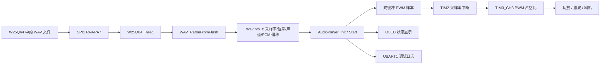

# MP3-Learn-02-Player 学习说明

## 1. 本项目目标

本项目只学习一件事：STM32 从 W25Q64 地址 0 读取已经下载好的 WAV 文件，解析 WAV 头，取出 PCM 数据，并通过 PB0 的 TIM3_CH3 PWM 输出到后级功放/喇叭。

它复用了完整工程中已经能工作的播放代码，但删掉了下载协议、写 Flash 状态机、验证读回入口等内容。学完本项目，你应该能看懂“Flash 读 WAV -> 解析 PCM 参数 -> 定时输出采样点 -> 喇叭发声”这一条链。

## 2. 数据流图



## 3. 主要文件说明

- `User/main.c`：本学习项目入口，只做硬件初始化、WAV 解析、启动播放和错误处理。
- `Hardware/wav.c/.h`：WAV 头解析器，从 W25Q64 读取 RIFF/WAVE/fmt/data chunk，得到 PCM 参数。
- `Hardware/audio_player.c/.h`：播放核心。把 8/16bit、单/双声道 PCM 转成 PWM 占空比，并用 TIM2 中断按采样率输出。
- `Hardware/bsp_w25q64.c/.h`：W25Q64 的底层 SPI 读命令。
- `Hardware/w25q64.c/.h`：应用层 W25Q64 包装，提供 JEDEC ID 检查和带边界检查的 `W25Q64_Read`。
- `Hardware/bsp_usart.c/.h`：串口调试日志输出；本项目不需要从串口接收文件，但保留 USART 方便看错误原因。
- `Hardware/ring_buffer.c/.h`：USART 驱动依赖的接收缓冲，在播放项目里不是主角。
- `Hardware/OLED.c/.h`：显示 W25Q64 状态、播放状态和错误状态。
- `Library/`：STM32F10x 标准外设库，本项目 Keil 工程只引用 RCC、FLASH、GPIO、SPI、USART、TIM、NVIC 相关源文件。

## 4. 核心函数调用链

启动和解析：

```text
main
  -> RCC_Configuration
  -> NVIC_Configuration
  -> USART1_Init
  -> GPIO_Configuration
  -> SPI1_Configuration
  -> W25Q64_DriverInit
  -> W25Q64_ReadJedecID
  -> WAV_ParseFromFlash
     -> W25Q64_Read
```

启动播放：

```text
main
  -> AudioPlayer_Init
     -> AudioPlayer_ConfigPwm
     -> AudioPlayer_ConfigSampleTimer
  -> AudioPlayer_Start
     -> AudioPlayer_FillBuffer
        -> W25Q64_Read
```

播放运行时：

```text
main while(1)
  -> AudioPlayer_Process
     -> AudioPlayer_FillBuffer

TIM2_IRQHandler
  -> 取当前缓冲区样本
  -> 写 TIM3->CCR3 改变 PWM 占空比
  -> 缓冲区播完后切换到另一块缓冲
```

## 5. main.c 执行流程逐行讲解

- 第 1-11 行：文件头说明工程目标、系统时钟和用到的引脚。注意音频输出是 PB0 的 TIM3 PWM。
- 第 13-20 行：包含播放项目需要的头文件，包含 `wav.h` 和 `audio_player.h`，不包含下载协议。
- 第 22-23 行：定义 WAV 文件在 W25Q64 中的起始地址和文件大小。当前沿用完整工程验证过的 `301810` 字节。
- 第 25-33 行：`LED_Blink` 用于启动自检提示。
- 第 35-50 行：`Debug_PrintWavInfo` 把解析出的 WAV 参数通过 USART1 打印出来。
- 第 52-68 行：`Debug_PrintAudioError` 把播放错误翻译成可读串口日志。
- 第 70-90 行：`RCC_Configuration` 配置 72MHz 系统时钟。
- 第 92-112 行：`GPIO_Configuration` 初始化 PC13 LED 和 W25Q64 CS。
- 第 114-145 行：`SPI1_Configuration` 初始化 SPI1，后续所有 Flash 读取都靠它。
- 第 147-150 行：`NVIC_Configuration` 设置中断优先级分组。
- 第 152-158 行：进入 `main`，定义循环计数、Flash ID、WAV 信息和解析状态。
- 第 159-164 行：初始化时钟、中断、串口、GPIO、SPI、W25Q64。
- 第 166-169 行：初始化 OLED，并通过串口打印启动日志。
- 第 171-180 行：读取 W25Q64 JEDEC ID，OLED 显示 OK 或 FAIL。
- 第 182-194 行：从 Flash 解析 WAV 文件。如果 RIFF/WAVE/fmt/data 不正确，就进入错误闪灯。
- 第 196-199 行：打印 WAV 参数，OLED 显示准备播放。
- 第 201-210 行：初始化并启动播放器。失败时进入错误闪灯。
- 第 212 行：串口输出 `Playback start`，说明 TIM2/TIM3 播放链已经启动。
- 第 214-216 行：主循环持续调用 `AudioPlayer_Process`，负责补充空闲缓冲区。
- 第 218-226 行：播放完成后打印日志、更新 OLED，并停在完成状态。
- 第 228-237 行：播放过程中出现读 Flash 失败或缓冲欠载时，打印错误并闪灯。
- 第 239-241 行：播放期间周期翻转 LED，表示主循环仍在运行。

## 6. 关键外设作用

- USART：本项目主要用于调试输出，例如启动日志、WAV 参数、播放错误。不承担文件下载。
- SPI：STM32 读取 W25Q64 的总线。WAV 头和 PCM 数据都通过 SPI1 读出。
- W25Q64：保存阶段 1 下载进去的 WAV 文件。播放项目假设 WAV 从地址 0 开始，大小为 `WAV_FILE_SIZE`。
- DAC：本项目未使用 STM32 内置 DAC。现有完整工程的可工作链路是 PWM 音频输出，不是真 DAC 输出。
- DMA：本项目未使用 DMA。PCM 数据由主循环填充双缓冲，TIM2 中断逐样本输出。
- Timer：本项目非常关键。TIM2 产生采样率节拍；TIM3_CH3 产生 PWM 波形，改变 `CCR3` 就是在改变当前音频样本的输出电平。

## 7. 应该重点看哪些代码

建议顺序：

1. 先看 `User/main.c`，理解”检查 Flash -> 解析 WAV -> 启动播放”的顺序。
2. 再看 `Hardware/wav.c`，理解 WAV 文件为什么必须找到 `fmt ` 和 `data` 两个 chunk。
3. 然后看 `Hardware/audio_player.c` 的 `AudioPlayer_Init`、`AudioPlayer_Start`、`AudioPlayer_Process`。
4. 最后看 `Hardware/audio_player.c` 里的 `TIM2_IRQHandler`，这是实际把样本送到 PWM 的地方。

## 8. 常见问题和调试方法

- OLED 显示 `WAV ERR`：通常是 W25Q64 中还没有写入正确 WAV，先运行 `MP3-Learn-01-Downloader` 下载文件。
- 串口提示 `RIFF not found`：Flash 地址 0 附近不是 WAV 文件头，检查下载是否从地址 0 开始。
- 串口提示 `unsupported WAV format`：当前播放器支持 PCM、8/16bit、单/双声道，不支持 MP3、float WAV 或压缩 WAV。
- 没声音但显示 PLAYING：检查 PB0 是否接到功放输入，功放供电和喇叭连接是否正确；PWM 输出通常需要滤波/功放才能听得舒服。
- 播放中 `buffer underflow`：Flash 读取太慢或中断被阻塞太久；先确认 SPI 分频、Flash 接线和电源稳定。
- 播放速度不对：检查 `wav_info.sample_rate` 的串口打印值，以及 TIM2 周期计算是否与 72MHz 时钟一致。
- 文件大小不对：修改 `User/main.c` 的 `WAV_FILE_SIZE`，它必须和下载到 Flash 的 WAV 文件字节数一致。

## 9. 和完整 MP3 工程的对应关系

本项目来自完整工程的 `APP_MODE_PLAYBACK` 分支。完整工程中播放部分和下载部分共用 W25Q64、USART、OLED、SPI 初始化；本项目把播放链单独拿出来，便于集中学习。

对应关系：

- 本项目 `User/wav.c` 对应完整工程同名文件，是从 Flash 里识别 WAV 的模块。
- 本项目 `User/audio_player.c` 对应完整工程同名文件，是 PWM 播放核心。
- 本项目 `User/bsp_w25q64.c`、`User/w25q64.c` 对应完整工程的 Flash 读取层。
- 学懂后回到完整工程时，重点看 `APP_MODE_PLAYBACK` 下 `WAV_ParseFromFlash`、`AudioPlayer_Init`、`AudioPlayer_Start`、`AudioPlayer_Process` 的位置，就能把本项目知识映射回完整播放器。
